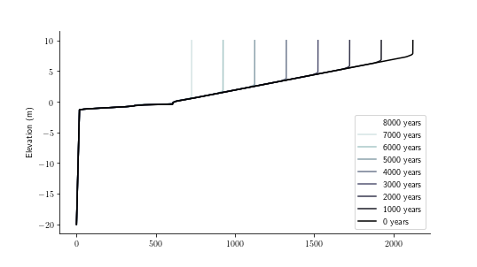
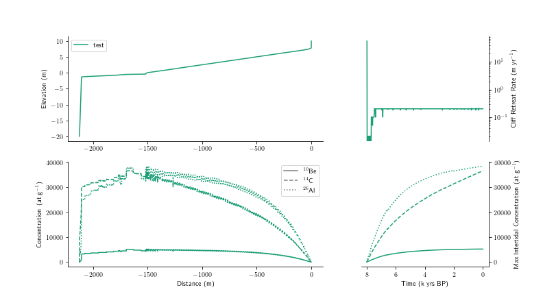

Rocky-Profile-Model (RPM)
=

This repository contains a C++ Implementation of Hiro Matsumoto's Rocky Profile Model for coupling with cosmogenic radionuclide accumulation components of RoBoCoP. 

The RPM object is the exploratory morphodynamic model developed by [Matsumoto et al. (2016a)](https://doi.org/10.1016/j.geomorph.2016.05.017) and [Matsumoto et al. (2016b)](http://www.bioone.org/doi/10.2112/SI75-120.1)).

This version was developed for coupling to predictions of cosmogenic isotope concentrations using the [RoBoCoP_CRN](https://github.com/mdhurst1/RoBoCoP_CRN/) model developed by [Hurst et al. (2016)](http://www.pnas.org/content/113/47/13336.abstract) and [Hurst et al. (2017)](http://www.earth-surf-dynam.net/5/67/2017/).

This code is made available on a GNU General Public License (see LICENSE in repository). Please cite the following papers when using or refering to this model:

JOSS PAPER REFERENCE GOES HERE

Model description
==


Documentation
==

The full documentation can be found [here](https://rocky-profile-model.readthedocs.io/en/joss-paper/).

Below is a brief summary to help you get started.

Installation
==

Clone this repository and compile with your favourite C++ compiler. 
Our preferred setup is Linux and the GNU compilers, and the repository contains make files for compiling the software. 
There is more information about software requirements available on the [documentation webpage]( https://rocky-profile-model.readthedocs.io/en/joss-paper/).

Usage
==

To compile the model on your local machine, use the `make` command and point it to the makefile in the repository:
```
Rocky-Profile-Model$ make -f RPM_CRN.make
```
This will result in an executable called `RPM_CRN.out`. 

The program can then be launched at the command line, requiring two input arguments.
* The path of the folder where the model will be run
* The name of the input parameter file (which must be in the folder where the model will be run)

The following command will launch the executable in its current directory with the default parameter values:
```
Rocky-Profile-Model$ RPM_CRN.out ./ example_parameter_file.txt
```
Alternatively you could move the parameter file to a directory for your project and customise it:
```
Rocky-Profile-Model$ RPM_CRN.out /home/mhurst/MyFirstRPMCRN/ modified_parameter_file.txt
```
For a detailed description of the contents of a parameter file, see the documentation [here](https://rocky-profile-model.readthedocs.io/en/joss-paper/).

The model output will be written to your project directory. There are two output files, one containing the timeseries of topographic evolution of the simulated rock coast, and once containing the corresponding timeseries of CRN concentrations at the surface of the topography.

For more information about the format of the output files, see the documentation [here](https://rocky-profile-model.readthedocs.io/en/joss-paper/).

Visualisation and further analysis of the model run is conducted in python (though you could write your own functions in a different language such as R or Matlab). A timeseries of the evolution of the model topography and snapshhot of the final CRN concentrations can be generated using `/plotting_functions/RPM_CRN_Figure.py`.

The first figure output shows a timeseries of the shore platform evolution over the duration of the model simulation, with topographic profiles plotted every thousand years of the simulation:



The second figure output shows (a) the final topographic profile; and also shows (b) the concentrations of the chosen CRNs (<sup>10</sup>Be, <sup>14</sup>C or <sup>26</sup>Al) distributed across the final model topography, (c) the timeseries of cliff retreat rates, and (d) the timeseries of the maximum CRN concentration for each chosen nuclide:



Issues
==

Please raise any issues [here](https://github.com/mdhurst1/Rocky-Profile-Model/issues).

References
==

Hurst, M. D., Rood, D. H., Ellis, M. A., Anderson, R. S. and Dornbusch, U.: Recent acceleration in coastal cliff retreat rates on the south coast of Great Britain, Proc. Natl. Acad. Sci., 113, 13336–13341, doi:[10.1073/PNAS.1613044113](https://doi.org/10.1073/PNAS.1613044113), 2016.

Hurst, M. D., Rood, D. H. and Ellis, M. A.: Controls on the distribution of cosmogenic 10Be across shore platforms, Earth Surf. Dyn., 5(1), doi:[10.5194/esurf-5-67-2017](https://doi.org/10.5194/esurf-5-67-2017), 2017.

Matsumoto, H., Dickson, M. E. and Kench, P. S.: An exploratory numerical model of rocky shore profile evolution, Geomorphology, 268, 98–109, doi:[10.1016/j.geomorph.2016.05.017](https://doi.org/10.1016/j.geomorph.2016.05.017), 2016a.

Matsumoto, H., Dickson, M. E. and Kench, P. S.: Modelling the Development of Varied Shore Profile Geometry on Rocky Coasts, J. Coast. Res., 75(sp1), 597–601, doi:[10.2112/SI75-120.1](https://doi.org/10.2112/SI75-120.1), 2016b.

Matsumoto, H., Dickson, M. E. and Kench, P. S.: Modelling the relative dominance of wave erosion and weathering processes in shore platform development in micro- to mega-tidal settings, , 2653(June), 2642–2653, doi:[10.1002/esp.4422](https://doi.org/10.1002/esp.4422), 2018.


Contributing and Collaborating
==

These software are intended as a tool for the research community. If you are interested in developing the model further or wish to apply it, please feel free to get in touch and work with us. 
